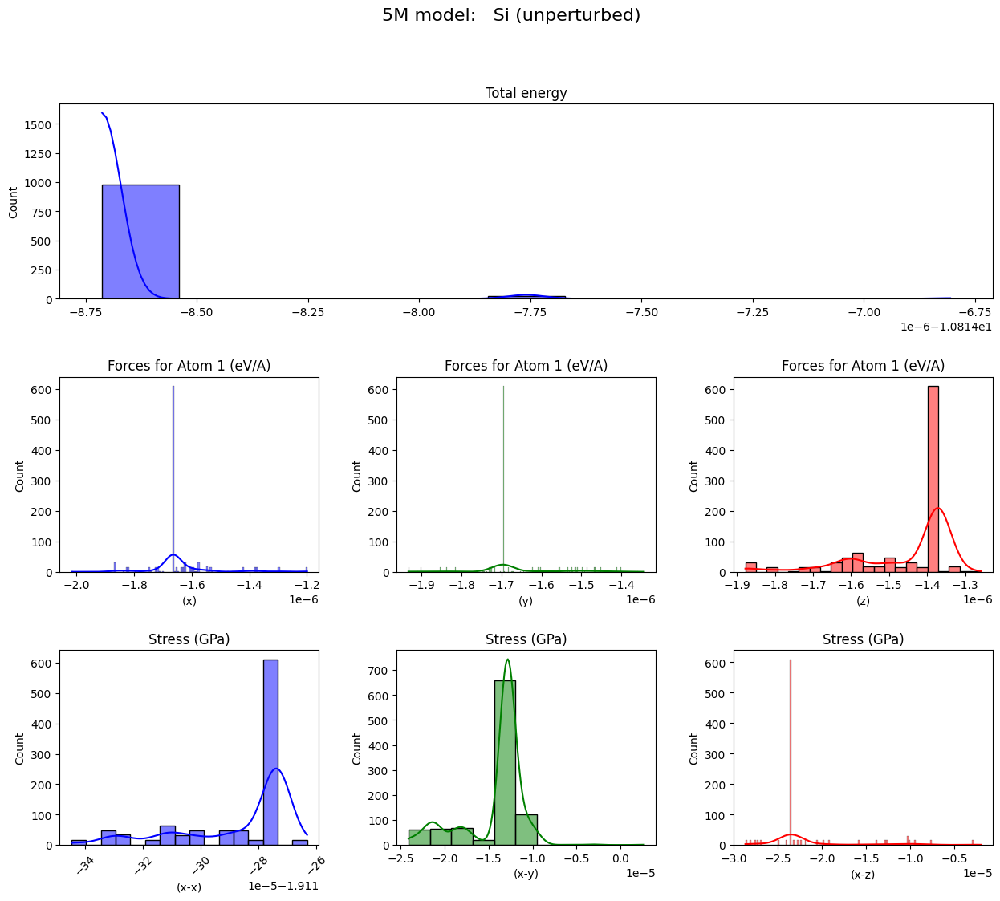
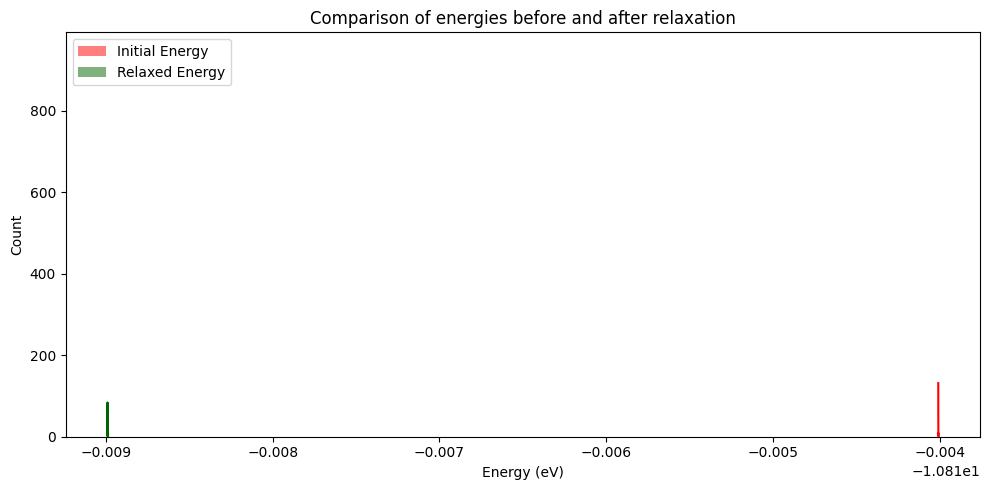
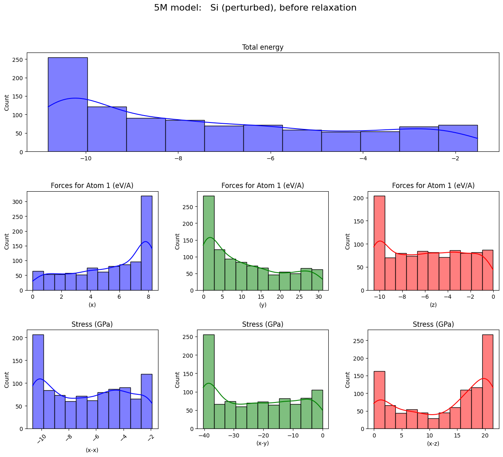
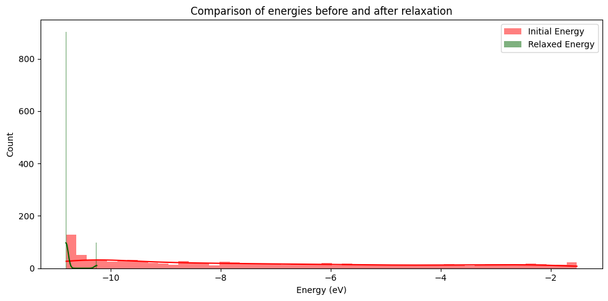
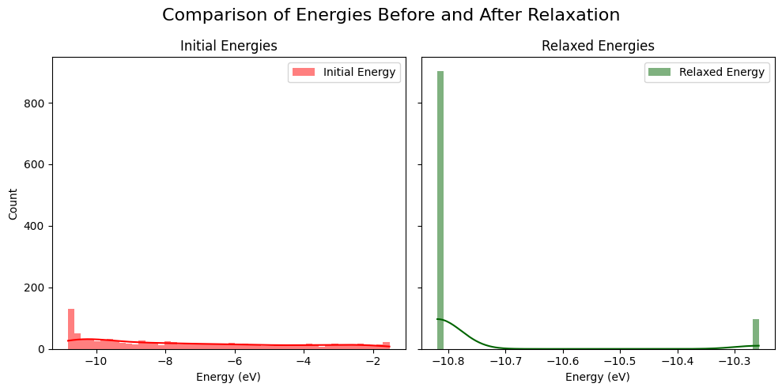

<div style="text-align: center">
<h1 style="text-align: center;">MatterSim</h1>

*[MatterSim](https://github.com/microsoft/mattersim/tree/main?tab=readme-ov-file#----) is a deep learning atomistic model across elements, temperatures and pressures.*
</div>

## 1. Using MatterSim
To run MatterSim, either create a clean conda environment as recommended or use a Docker container for better reproducibility.
You can set up a Docker container using NVIDIA’s official PyTorch image:
```bash
docker pull nvcr.io/nvidia/pytorch:24.12-py3
docker run --gpus all -it --rm nvcr.io/nvidia/pytorch:24.12-py3
```
1. Prerequisite
   - `Python 3.12x`
   - While the MatterSim authors recommend `Python 3.9`, this project is optimized for `Python 3.12.x`.
2. Clone the repository:
   ```bash
   git clone git@seagit.okla.seagate.com:adapt-ml/materials-discovery.git
   cd materials-discovery/matter/
   ```
3. Install dependencies as necessary. Run:
   ```bash
   pip install -r requirements.txt
   ```
   or install dependencies manually.
   
## 2. Streamlit app (Structure Analysis with MatterSim)

This Streamlit application provides a user-friendly interface for analyzing atomic and crystal structures using the MatterSim force field.  It allows users to define structures, perform structural relaxations, and run molecular dynamics (MD) simulations.

#### Features

* **Model and Device Selection:**
  * Choose between different MatterSim models (1M, 5M).
  * Select the computation device (CUDA if available, or CPU).
* **Structure Building:** Create atomic structures using either:
    * **Crystal Builder:** Defines structures based on space group and lattice parameters, ensuring crystallographic symmetry.
    * **Atoms Builder:** Defines structures by specifying atomic symbols and Cartesian coordinates. This also allows running molecular dynamics (MD) simulations.
* **Structure Perturbation:** Introduce random atomic displacements ("rattle") to simulate structural variations.
* **Structural Relaxation:** Optimize structures using BFGS or FIRE algorithms with optional filters (ExpCellFilter, FrechetCellFilter) and symmetry constraints.
* **Energy Calculation:** Calculate potential energy of the given structure.
* **Molecular Dynamics (MD) Simulations:** Run MD simulations with different ensembles (NVT_NOSE_HOOVER, NVT_BERENDSEN).
* **Pressure and Temperature Control:**
  * Perform relaxation at pressures ≥ 0 GPa.
  * Run MD simulations at temperatures > 0 K.

* **Parameter Control:**  Fine-grained control over relaxation and MD simulation parameters.
* **Result Display:** Show computed energies, lattice parameters, and other relevant information.
* **Visualisation:** Interactive 3D visualization of the structures.

#### Running the app

In your terminal, run:
   ```bash
   streamlit run app.py
   ```
This will open the app in your web browser.

#### Usage
**Model and Device Configuration:** In the sidebar, select the desired MatterSim model (1M or 5M) and choose the computational device (CUDA or CPU). If no GPU is detected, CPU will be selected by default.

**Structure Definition:** Choose between Crystal Builder and Atoms Builder, then provide the necessary inputs such as atomic symbols, basis positions, lattice parameters, and space group (if applicable).

> 🚨 Crystal Builder takes in **fractional** coordinates, while Atoms Builder takes in **cartesean** coordinates.

**Structure Perturbation (Optional):** Toggle the "Rattle" option to introduce small random displacements to atomic positions, simulating structural variations.

**Lattice Visualisation:** Adjust the "Number of cells to display per axis" to control the size of the visualized structure in the 3D viewer.

**Initial Structure:** The initial structure is displayed with its energy and lattice parameters, calculated at 0 K and 0 GPa.

**Relax Structure:** Configure relaxation parameters in the sidebar and click "Relax Structure" to perform structural relaxation. The relaxed structure and corresponding results will be displayed.

**Molecular Dynamics (MD) Simulation (Atoms Builder only):** Configure MD simulation parameters and click “Start MD simulation” to initiate the simulation.

#### Contributing
Contributions are welcome! Please open an issue or submit a pull request.

## 3. Notebooks
Define the variable `model` accordingly to run the 1M or 5M model. e.g., `model = 1` for the 1M model
1. **Structure optimization**
   1. Predicted energy, forces & stresses of a single Si or C lattice
   2. Perturbed the structure
   3. Relaxed the structure
   4. Predicted energy, forces & stresses of the relaxed lattice
2. **Batch structure optimization**
   1. Predicted energy, forces & stresses of 1000 Si lattices
   2. Perturbed the structures using .rattle method
   3. Relaxed the structures
   4. Predicted energy, forces & stresses of the 1000 relaxed lattices
   5. For all structures above, use `plot_potential` and `plot_relaxation` to visualise the energy distribution.
3. **Playground**
   1. To try running the relaxation and predictions with FePt L1<sub>o</sub> lattice
   2. Use `visualise_structure` to visualise a lattice structure.
4. **Molecular dynamics (MD)**
   1. Run MD simulation on FePt lattice

#### Utility functions
1. **Plot potential**: Plot distribution of energy, forces and stresses
2. **Plot relaxation**: Plot energies before and after relaxation
3. **Visualise structure**: Visualise a lattice structure

#### Key observations

##### 1. Reproducibility of predictions

For 1000 identical silicon diamond structures generated using `si = bulk("Si", "diamond", a=5.43)`, predictions for energy, force, and stress remain largely consistent. However, small variations are observed when using batch processing. This discrepancy is likely due to numerical precision differences introduced during batched computations.

To confirm this, inference on 1000 identical structures was performed individually:
```python
# Run individual predictions for 1000 identical Si structures
bulk_predictions = []
for _ in range(1000):
    si = bulk("Si", "diamond", a=5.43)
    si.calc = MatterSimCalculator(load_path=f"MatterSim-v1.0.0-{model}M.pth", device=device)
    bulk_predictions.append(si.get_potential_energy())

# Verify consistency
for i in range(1000):
    assert bulk_predictions[i] == bulk_predictions[0], f"Energy of structure {i} is different: {bulk_predictions[i]}!"
```
Since this assertion returned no errors, it confirms that individual computations produce identical results. The observed variations in batched inference likely stem from floating-point precision differences or computational optimizations performed during batch processing.



##### 2. Energy minimization through relaxation
As expected, structural relaxation consistently lowers the energy of the 1000 identical Si diamond structures.




##### 3. Impact of atomic displacement on predictions
1000 identical Si diamond structures were perturbed using `si.rattle(stdev=np.random.random())`. Introducing random atomic displacements results in significantly increased variation in predicted energies, forces, and stresses.  This reflects the sensitivity of these properties to structural changes.



##### 4. Energy convergence after relaxation
Despite the initial variation in predicted energies due to the random perturbations, subsequent structural relaxation brings the energies of the 1000 structures into a narrower, more consistent range.  This indicates that relaxation effectively minimizes the energy of the perturbed structures, leading to a more homogeneous energetic state.

